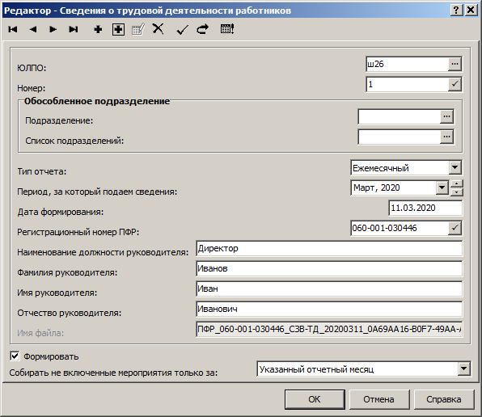
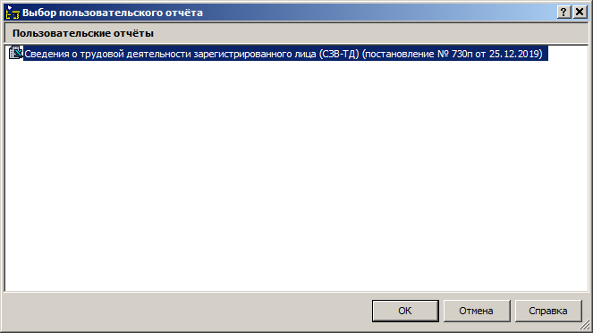

# Электронные трудовые книжки

## Журнал электронных трудовых книжек

Приложение **Подушевое финансирование в образовании**, меню **Дорументы**, раздел **Журнал электронных трудовых книжек**.

В _верхней части_ экрана отражается ФИО сотрудников — это перечень трудовых книжек. 

В _нижней части_ экрана отражается записи каждой трудовой книжки — **Сведения о трудовой деятельности**, они будут наполняться данными автоматически после отработки приказов.

> _Будьте внимательны при регистрации приказов в Парусе! Теперь результат ваших действий после отработки приказов будет попадать в электронные трудовые книжки сотрудников в ПФР._

## Сведения о трудовой деятельности работников

### Формирование отчёта СЗВ-ТД

1. Меню **Учёт**, раздел **Сведения о трудовой деятельности**
2. Правая кнопка мыши (ПКМ), **Добавить**

3. Выберите ЮЛПО (ваше учреждение) из словаря.
4. Заполните наименование должности и ФИО руководителя.
5. Укажите `последний день месяца` периода, за который подаются сведения.
6. Выберите режим сбора мероприятий `Указанный отчётный месяц и все предыдущие`.
7. **ОК**

В _нижней части_ раздела появятся сведения вашего будущего отчета. Там будут перечислены все сотрудники по которым были какие-либо кадровые  изменения в течение месяца, подлежащие передаче в ПФР. Кроме этого если по человеку передаются сведения электронно впервые, то будет ещё одна строка — последнее кадровое изменение до 01.01.2020г. Вторая строка, конечно же, будет тогда, когда это последнее кадровое изменение было в этом же учреждении и в Парусе это действие было выполнено корректно — через приказы.

### Печать / выгрузка отчёта СЗВ-ТД

1. В _верхней части_ раздела правая кнопка мыши (ПКМ), **Расширения, Пользовательские отчеты, ОК**.

2. Выберите режим: 
* Печать
* Выгрузка
* Печать отчета и выгрузка

Выгруженный отчёт можно проверить программой ПФР. Программу можно скачать по ссылке: http://www.pfrf.ru/strahovatelyam/for_employers/software/

> _Не торопитесь отправлять отчёты! Проверьте все данные полученные из Паруса! Все ли попало в отчёт? Нет ли ничего лишнего? Только после того, как убедитесь, что все верно — отправляйте._
