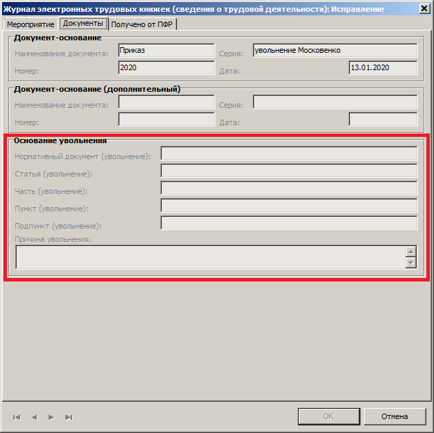
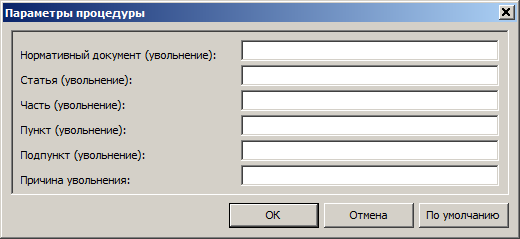

# Электронные трудовые книжки

## Журнал электронных трудовых книжек

Приложение **Подушевое финансирование в образовании**, меню **Дорументы**, раздел **Журнал электронных трудовых книжек**. Открывается форма отбора, тут ничего не нужно заполнять, нажмите кнопку **ОК**.

В _верхней части_ экрана отражается ФИО сотрудников — это перечень трудовых книжек. 

В _нижней части_ экрана отражается записи каждой трудовой книжки — **Сведения о трудовой деятельности**, они будут наполняться данными автоматически после отработки приказов.

### Формирование сведений на начало ведения учёта

> _Данное действие выполняется один раз на начало ведения учёта в случае, если в **Журнале электронных трудовых книжек** недостаточно данных._

1. Меню **Документы**, раздел **Журнал электронных трудовых книжек**.
2. Правая кнопка мыши, **Расширения, Прользовательские процедуры, Создание сведений на начало ведения учета**. Укажите свою организацию, период с `01.01.2020`, флаг `Учесть последнее на дату С`. Данные по предыдущим кадровым изменениям формируются из раздела **Учёт, Сотрудники, Анкета, Трудовая деятельность**.

> _Будьте внимательны при регистрации приказов в Парусе! Теперь результат ваших действий после отработки приказов будет попадать в электронные трудовые книжки сотрудников в ПФР._

## Сведения о трудовой деятельности работников

### Формирование отчёта СЗВ-ТД

1. Меню **Учёт**, раздел **Сведения о трудовой деятельности**.
2. Правая кнопка мыши, **Добавить**.

> _Поле **Подразделение** в группе **Обособленное подразделение** должно быть пустым._

3. Выберите ЮЛПО (ваше учреждение) из словаря.
4. Заполните наименование должности и ФИО руководителя.
5. Укажите `последний день месяца` периода, за который подаются сведения.
6. Выберите режим сбора мероприятий `Указанный отчётный месяц и все предыдущие`.
7. **ОК**

В _нижней части_ раздела появятся сведения вашего будущего отчета. Там будут перечислены все сотрудники по которым были какие-либо кадровые  изменения в течение месяца, подлежащие передаче в ПФР.

> _Внутреннее совмещение не включается в отчёт СЗВ-ТД._

### Основание увольнения

Если в _нижней части_ раздела есть увольнение, то должны быть заполнены поля основания увольнения. На записи увольнения правая кнопка мыши, **Исправить**, вкладка **Документ**.

Если поля основания увольнения пустые, нажмите кнопку **Отмена**, на записи увольнения правая кнопка мыши, **Расширения, Пользовательские процеруды, Исправление параметров увольнения в сведениях о трудовой деятельности**. Заполните параметры, нажмите **OK**.

### Переформирование данных СЗВ-ТД

На строке сведений о трудовой деятельности работников, которую нужно переформировать, правая кнопка мыши, **Сформировать состав**. Если переформировываются первоначальные сведения, то выберите `Указанный отчётный месяц и все предыдущие`, если переформировывается один месяц, то выберите `Указанный отчётный месяц`.

### Печать / выгрузка отчёта СЗВ-ТД

1. В _верхней части_ раздела правая кнопка мыши, **Расширения, Пользовательские отчеты, ОК**.

2. Выберите режим: 
* Печать
* Выгрузка
* Печать отчета и выгрузка

Выгруженный отчёт виде файла `xml` можно проверить программой ПФР. Программу можно скачать по ссылке: http://www.pfrf.ru/strahovatelyam/for_employers/software/

Файл `xml` нужно отправить в ПФР через СБИС или любую другую «транспортную» систему.

> _Не торопитесь отправлять отчёты! Проверьте все данные полученные из Паруса! Все ли попало в отчёт? Нет ли ничего лишнего? Только после того, как убедитесь, что все верно — отправляйте._

## Исправление приказов после формирования отчёта СЗВ-ТД

> _Исправить приказы можно до отправления отчёта СЗВ-ТД в ПФР._

1. Меню **Учёт**, раздел **Сведения о трудовой деятельности**.
2. В спецификации **Сведения о мероприятиях кадрового учёта** отметьте записи, которые нужно исключить, правая кнопка мыши, **Исключить**.

3. В спецификации **Заявления сотрудника** отметьте записи, которые нужно исключить, правая кнопка мыши, **Исключить**.

4. Меню **Учёт**, раздел **Журнал электронных трудовых книжек**, спецификация **Сведения о трудовой деятельности**.
5. Отметьте записи, которые нужно удалить, правая кнопка мыши, **Удалить**.

6. Снимите отработку с приказа, исправьте его и снова отработайте.

> _Если нужно исправить приказ на приём, то сначала нужно снять отработку с приказа на увольнение, затем с приказа на приём._

7. Снова сформируйте отчёт СЗВ-ТД.