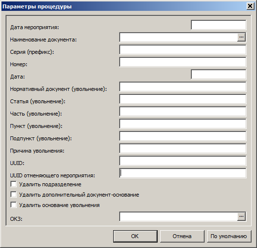

# Электронные трудовые книжки

## Журнал электронных трудовых книжек

Приложение **Кадры и штатное расписание**, меню **Дорументы**, раздел **Журнал электронных трудовых книжек**. Открывается форма отбора, тут ничего не нужно заполнять, нажмите кнопку **ОК**.

В _верхней части_ экрана отражается ФИО сотрудников — это перечень трудовых книжек. 

В _нижней части_ экрана отражается записи каждой трудовой книжки — **Сведения о трудовой деятельности**, они будут наполняться данными автоматически после отработки приказов.

### Формирование сведений на начало ведения учёта

> _Данное действие выполняется один раз на начало ведения учёта в случае, если в **Журнале электронных трудовых книжек** недостаточно данных._

1. Меню **Документы**, раздел **Журнал электронных трудовых книжек**.
2. Правая кнопка мыши, **Расширения, Прользовательские процедуры, Создание сведений на начало ведения учета**. Укажите свою организацию, период с `01.01.2020`, флаг `Учесть последнее на дату С`. Данные по предыдущим кадровым изменениям формируются из раздела **Учёт, Сотрудники, Анкета, Трудовая деятельность**.
3. Если сведения не появились, значит, в системе отсутсвуют соответсвующие приказы. В этом случае добавьте сведения вручную: правая кнопка мыши, **Добавить**.

### Присвоение квалификационной категории
1. Меню **Документы**, раздел **Приказы**.
2. Приказ `Изменение` пункт приказа `Присвоить квалификационную категорию`. Выберите сотрудника, категорию, дату присвоения.
3. Отработайте приказ.
4. [Проверьте](#журнал-электронных-трудовых-книжек) запись о присвоении в разделе **Журнал электронных трудовых книжек**.
5. [Переформируйте](#переформирование-данных-ефс-1) данные ЕФС-1.

### Заявление о продолжении ведения бумажной ТК

Приложение **Кадры и штатное расписание**, меню **Дорументы**, раздел **Журнал электронных трудовых книжек**. Открывается форма отбора, тут ничего не нужно заполнять, нажмите кнопку **ОК**.

В _верхней части_ экрана отражается ФИО сотрудников — это перечень трудовых книжек. 

В _нижней части_ экрана отражаются **Заявления сотрудника**. Чтобы добавить заявление, нажмите правую кнопку мыши, **Добавить**.

## Сведения о трудовой деятельности работников

### Формирование отчёта ЕФС-1

1. Меню **Учёт**, раздел **Сведения о трудовой деятельности**.
2. Правая кнопка мыши, **Добавить**.

> _Поле **Подразделение** в группе **Обособленное подразделение** должно быть пустым._

3. Выберите ЮЛПО (ваше учреждение) из словаря.
4. Заполните наименование должности и ФИО руководителя.
5. Укажите `последний день месяца` периода, за который подаются сведения.
6. Выберите режим сбора мероприятий `Указанный отчётный месяц и все предыдущие`.
7. **ОК**

В _нижней части_ раздела появятся сведения вашего будущего отчета. Там будут перечислены все сотрудники по которым были какие-либо кадровые  изменения в течение месяца, подлежащие передаче в ПФР.

> _Внутреннее совмещение не включается в отчёт._

### Исправление сведений о трудовой деятельности

Для всех кадровых мероприятий должны быть заполнены поля документа-снования: Наименование документа (например, ПРИКАЗ), номер и дата. Для увольнения, должны быть заполнены поля основания увольнения. 

На записи кадрового мероприятия правая кнопка мыши, **Расширения, Пользовательские процеруды, Исправление сведений о трудовой деятельности**. Заполните параметры, нажмите **OK**.

> _Если какой-либо параметр не заполнен, он не исправляется._

### Отмена кадрового мероприятия

Для регистрации отменяющего мероприятия необходимо:
1. у сотрудника в разделе **Журнал электронных трудовых книжек** найти кадровое мероприятие, которое необходимо отменить;
2. щелкнуть правой кнопкой мыши по исходному (неверному) мероприятию и в контекстном меню выбрать пункт **Отменить**;
3. в открывшемся окне указать дату отмены.

В результате создастся отменяющая запись с заполненным полем _UUID отменяемого мероприятия_.  
Затем эту запись необходимо включить в отчет. 

Для включения в отчет есть два способа:
1. заново сформировать состав отчета в разделе **Сведения о трудовой деятельности**;
2. или если у вас ранее весь отчет уже был сформирован и вам необходимо включить только что зарегистрированное кадровое мероприятие, то для этого в контекстном меню есть пункт **Включить в отчёт**.

### Переформирование данных ЕФС-1

На строке сведений о трудовой деятельности работников, которую нужно переформировать, правая кнопка мыши, **Сформировать состав**. Если переформировываются первоначальные сведения, то выберите `Указанный отчётный месяц и все предыдущие`, если переформировывается один месяц, то выберите `Указанный отчётный месяц`.

### Печать / выгрузка отчёта

1. В _верхней части_ раздела правая кнопка мыши, **Расширения, Пользовательские отчеты, ОК**.

2. Выберите режим: 
* Печать
* Выгрузка
* Печать отчета и выгрузка

Выгруженный отчёт виде файла `xml` можно проверить программой ПФР. Программу можно скачать по ссылке: https://pfr.gov.ru/employers/software/software

Файл `xml` нужно отправить в ПФР через СБИС или любую другую «транспортную» систему.

> _Не торопитесь отправлять отчёты! Проверьте все данные полученные из Паруса! Все ли попало в отчёт? Нет ли чего лишнего? Только после того, как убедитесь, что все верно — отправляйте._

## Исправление приказов после формирования отчёта

> _Исправить приказы можно до отправления отчёта ЕФС-1 в ПФР._

1. Меню **Учёт**, раздел **Сведения о трудовой деятельности**.
2. В спецификации **Сведения о мероприятиях кадрового учёта** отметьте записи, которые нужно исключить, правая кнопка мыши, **Исключить**.

3. В спецификации **Заявления сотрудника** отметьте записи, которые нужно исключить, правая кнопка мыши, **Исключить**.

4. Меню **Учёт**, раздел **Журнал электронных трудовых книжек**, спецификация **Сведения о трудовой деятельности**.
5. Отметьте записи, которые нужно удалить, правая кнопка мыши, **Удалить**.

6. Снимите отработку с приказа, исправьте его и снова отработайте.

> _Если нужно исправить приказ на приём, то сначала нужно снять отработку с приказа на увольнение, затем с приказа на приём._

7. Снова сформируйте отчёт ЕФС-1.