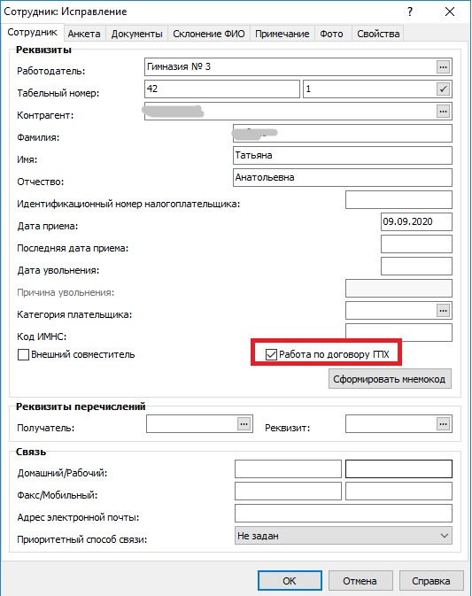
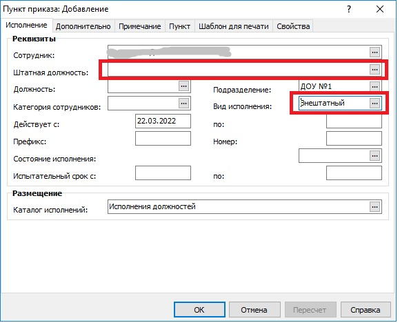

# Работа по договору ГПХ

При приёме сотрудника на работу в карточке сотрудника необходимо установить галку `Работа по договору ГПХ`.

В приказе о приёме НЕ нужно заполнять штатную должность, а в поле `Вид исполнения` необходимо указать значение `Внештатный`.

ФОТ добавляется как обычно в пункте приказа в спецификации ФОТ.
