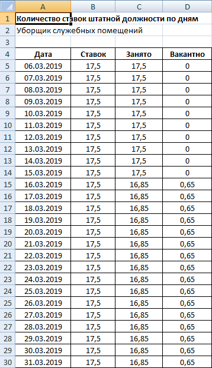
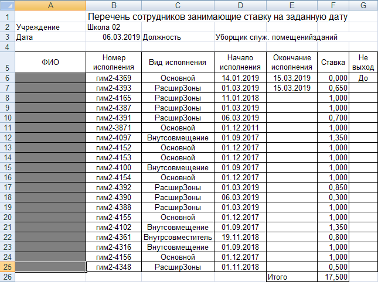

# Количество ставок штатной должности по дням

## Запуск

1. Запустите **Парус**.
2. Приложение **Подушевое финансирование в образовании**.

> _Если запускается другое приложение, откройте меню **Файл, Начать сеанс, Завершить сеанс работы** = Да, дождитесь появления окна входа в **Парус**, выберите нужное **Приложение** из ниспадающего списка_.

## Когда использовать

Если при отработке приказа возникает сообщение

> _При отработке пункта 1 приказа № было превышено количество ставок по штатной должности_

## Отчёт

1. На пункте приказа, который не отрабатывается, правая кнопка мыши, **Исправить**.
2. На поле **Штатная должность** нажмите кнопку с тремя точками справа.

Либо

1. Откройте меню **Учёт**, раздел **Штатные должности**, **По подразделениям**.
2. При первом входе выберите подразделение своего учреждения (структура слева).

Далее 

3. Выберите штатную должность, правая кнопка мыши, **Расширения, Пользовательские отчёты, Количество ставок штатной должности по дням**.
4. Укажите дату начала и дату окончания такие же как в пункте приказа, который не отрабатывается. Если в пункте приказа не установлена дата окончания, укажите последний день текущего месяца.

## Проверка

> _Если нужно выяснить, какие именно сотрудники и сколько ставок занимали в конкретный день._

1. Выберите штатную должность, правая кнопка мыши, **Расширения, Пользовательские отчёты, Проверка количества занимаемых ставок  на дату**.
2. Укажите дату.

