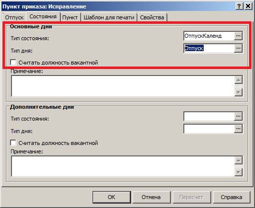
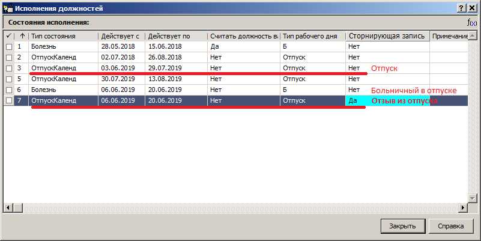

# Отзыв из отпуска

1. Для отзыва из отпуска, в том числе при больничном во время отпуска, требуется отработать приказ по образцу **Отп отзыв ОДИН** из каталога **Образцы приказов/Исполнение должностей/Отпуска**.

> _Начало и окончание отзыва должны соответствовать периоду больничного во время отпуска._

2. Для каждого исполнения должности сотрудника, для которого есть отпуск, добавьте пункт приказа по образцу **Отзыв из отпуска**. Параметры отзыва должны совпадать с отпуском. Эти параметры можно посмотреть в спецификации **Состояния** (меню Учёт, Штат, на исполнении должности правая кнопка мыши, Состояния) каждого исполнения должности в разделе **Штат** либо в соответсвующих пунктах приказа на отпуск. Должны совпадать следующие параметры:

* **Тип состояния** (обычно **ОтпускКаленд**)
* **Тип дня** (обычно **Отпуск**)
* **Считать должность вакантной** (обычно **Нет**)

> _Если какой-либо из этих параметров отзыва не совпадает с отпуском, отзыва не происходит._

3. Отработайте приказ и проверьте состояния каждого исполнения должности. Для каждой записи отпуска должна быть запись отзыва с признаком сторнирования.

> _Если в табеле отработанного времени остаётся больничный, значит, данные о больничном уже попали в основания расчёта зарплаты, а они имеют больший приоритет для табеля. В этом случае обратитесь в отдел зарплаты в централизованной бухгалтерии._
