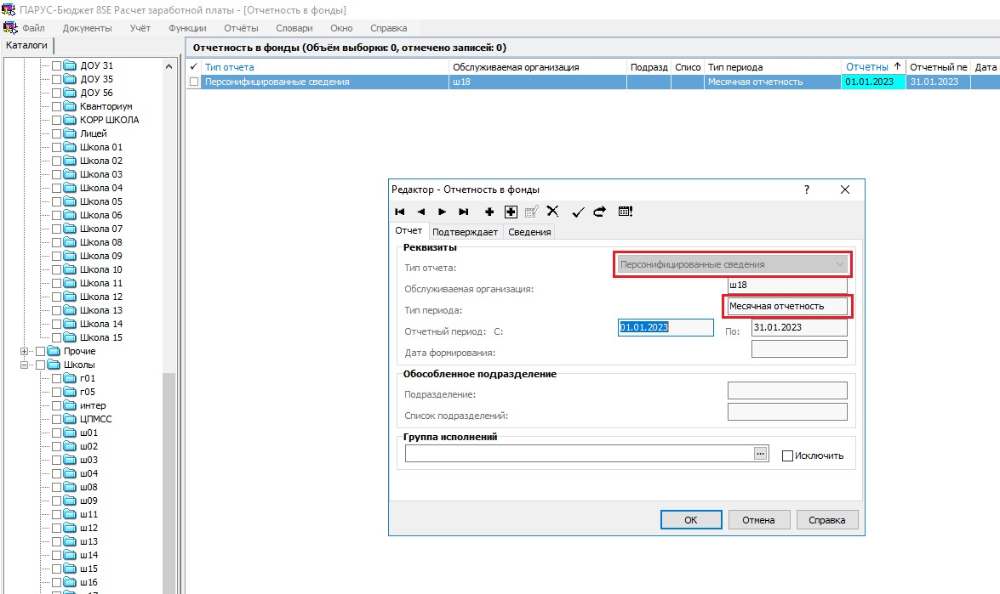
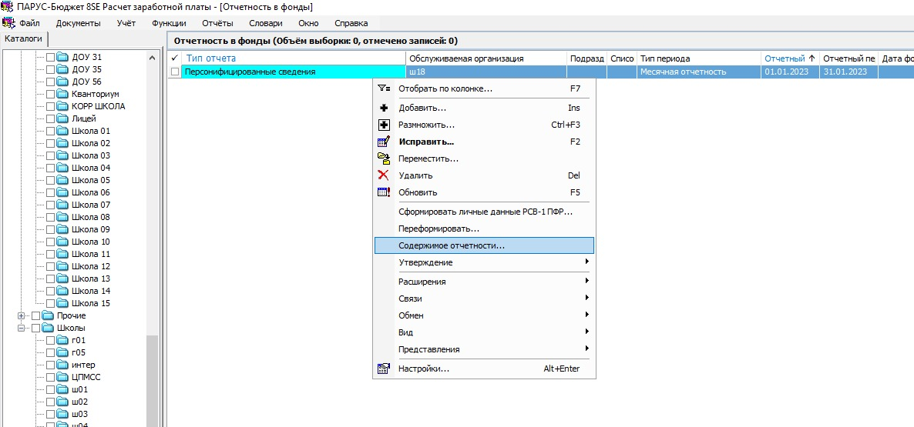
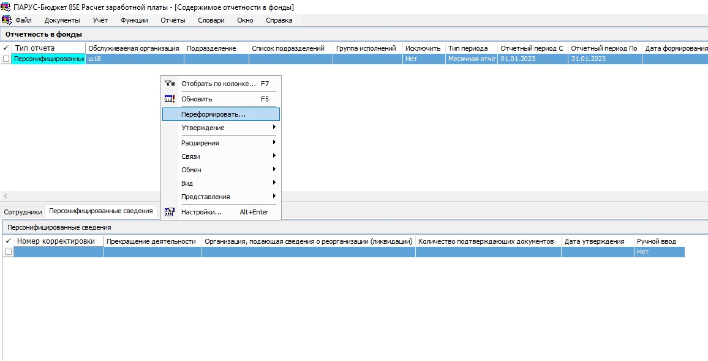
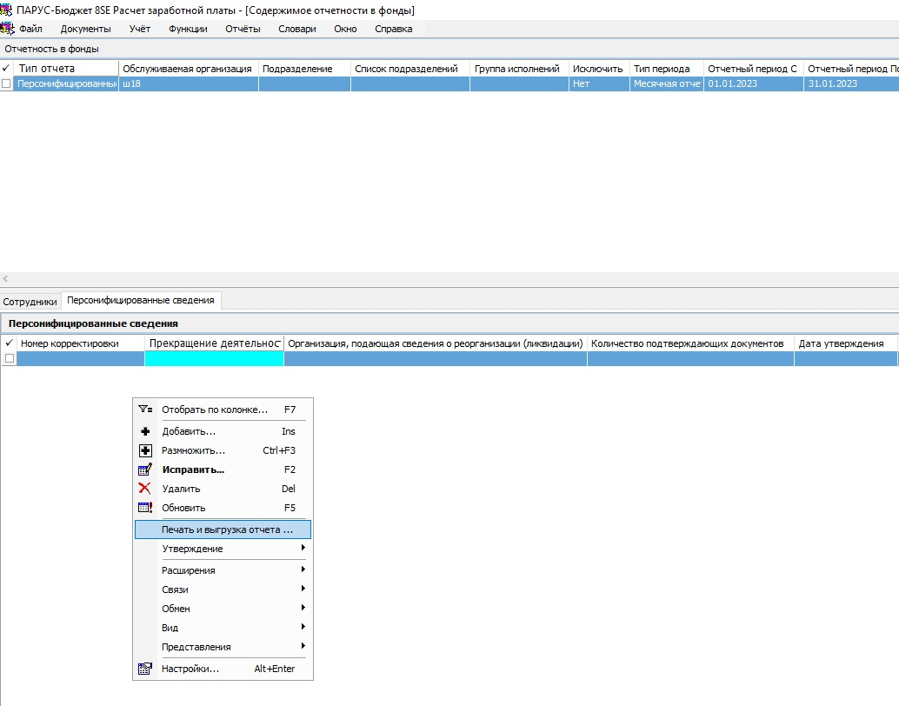
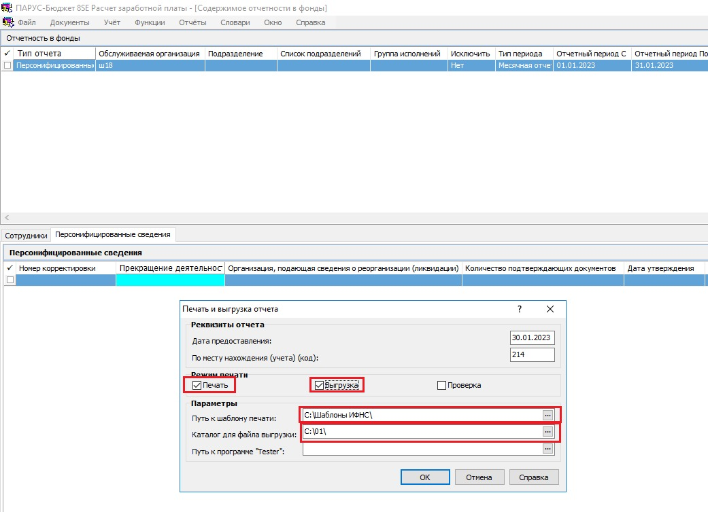

# Персонифицированные сведения

## Подготовка шаблона отчёта

Создайте на своём компьютере папку с шаблонами. В созданную папку скачайте шаблон ИФНС для печати [1151162_5.01000_01.tif](images/1151162_5.01000_01.tif)

## Добавление отчётности в фонды

Приложение **Кадры и штатное расписание**, меню **Учёт, Отчётность в фонды**, контекстное меню (правая кнопка мыши), **Добавить**.

На добавленном отчёте контекстное меню, **Содержимое отчетности**.

Контекстное меню, **Переформировать**

## Печать и выгрузка отчёта

Вкладка **Персонифицированные сведения**, контекстне меню, **Печать и выгрузка отчёта**

В параметрах отчёта задайте папку с шаблоном и папку для выгрузки  

