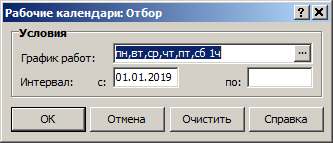
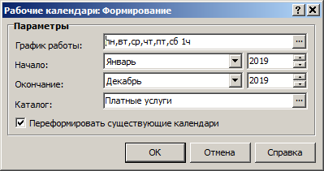

# Рабочие календари

1. Для формирования рабочего календаря по графику работ откройте приложение **Расчёт оплаты услуг учреждения**, меню **Учёт**, раздел **Рабочие календари**.

> _Если запускается другое приложение без диалогового окна входа, откройте меню **Файл, Начать сеанс, Завершить сеанс работы** = Да, дождитесь появления окна входа в **Парус**, выберите нужное приложение._

2. Откройте нужный каталог в структуре слева.

3. Для переформирования выберите уже существующие рабочие календари: правая кнопка мыши, **Отобрать**, отметьте их для переформирования.

4. Сформируйте рабочие календари по графику работ: правая кнопка мыши, **Формирование, По графику работ**.

