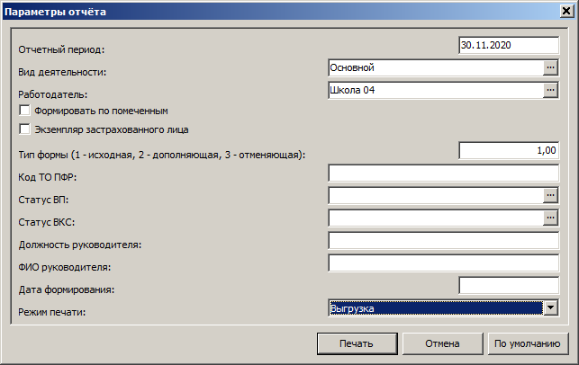

## СЗВ-М

## Формирование сведений

1. Любое приложение, где есть раздел **Учёт/Сотрудники**: **Кадры и штатное расписание, Подушевое финансирование в образовании, Расчёт заработной платы**.

> _Если запускается другое приложение без диалогового окна входа, откройте меню **Файл, Начать сеанс, Завершить сеанс работы** = Да, дождитесь появления окна входа в **Парус**, выберите нужное приложение._

2. Правая кнопка мыши, **Расширения, Пользовательские отчёты, Форма СЗВ-М (2017г.)**. Отчёт может формироваться по отмеченным сотрудникам либо по всем сотрудникам учреждения, работавшим за отчетный период.  Это задается в параметрах отчета при помощи флага "Формировать по отмеченным". Рекомендуется этот флаг не ставить. Если все же нужно сформировать отчёт по отмеченным сотрудникам, то перед запуском отчета необходимо отметить сотрудников, которых необходимо включить в отчёт.

Выберите режим:
* Печать
* Выгрузка
* Печать отчёта и выгрузка

Файл `xml` нужно отправить в ПФР через СБИС или любую другую «транспортную» систему.