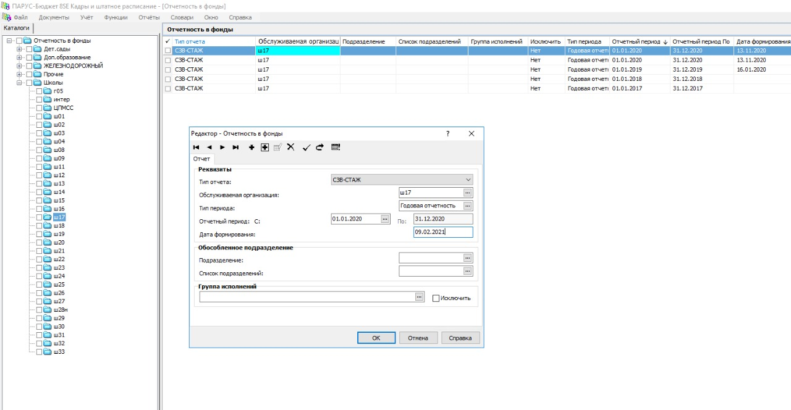
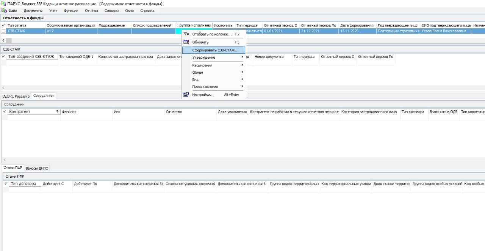
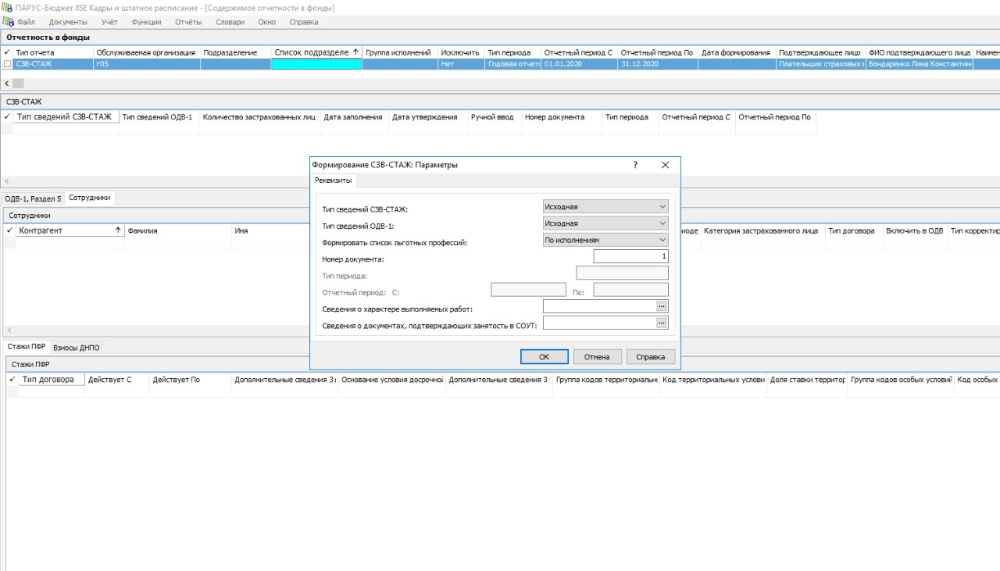
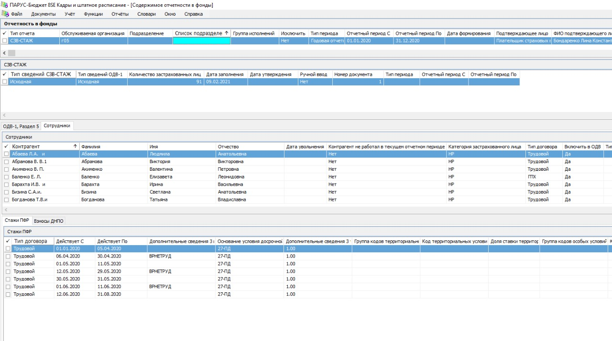
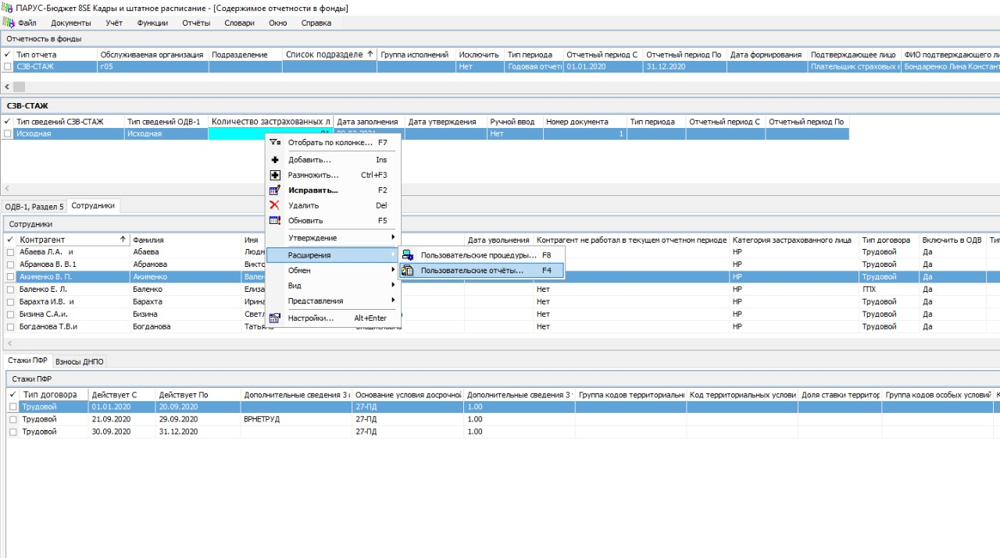
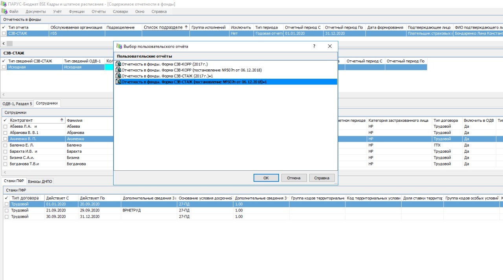
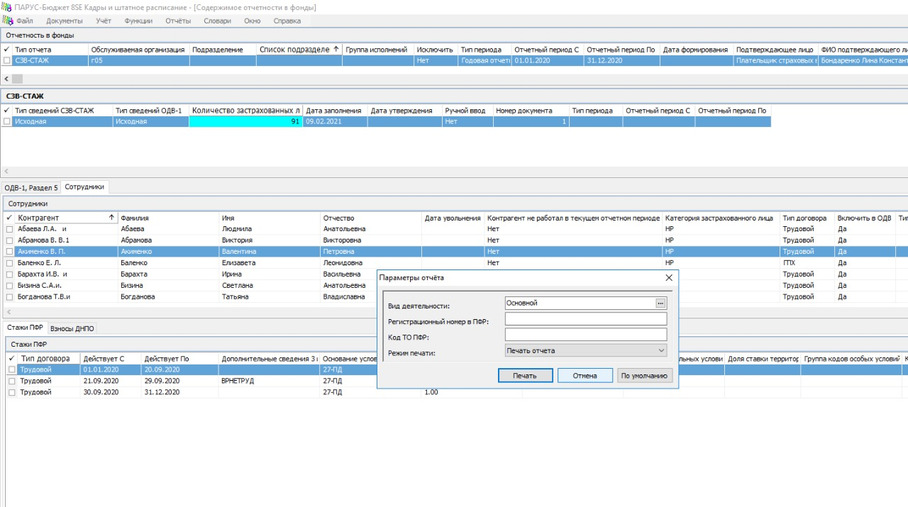
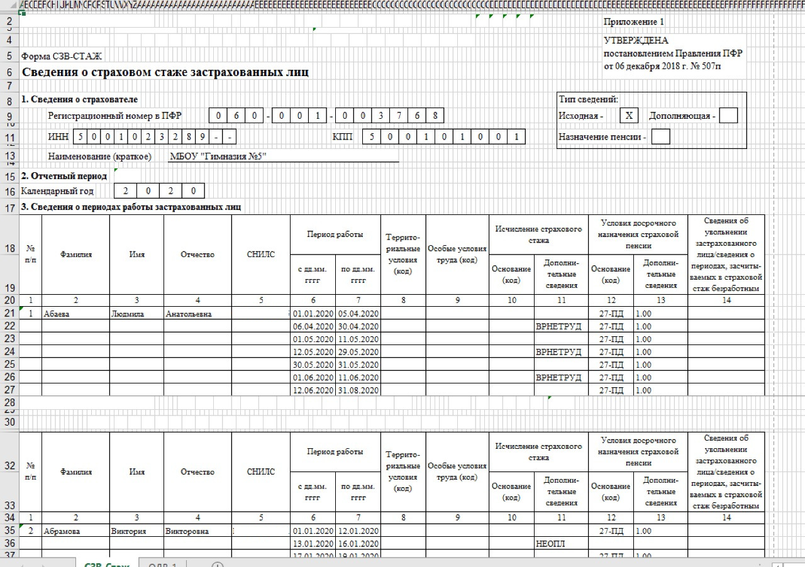

# СЗВ-СТАЖ

## Формирование отчёта

Отчёт можно сформировать из приложений:
- Кадры и штатное расписание,
- Расчёт заработной платы.

Отчет формируется в разделе **Учёт, Отчетность в фонды**. Добавляется запись в разделе с параметрами:

Нажимаем ОК.

Жмём правой кнопкой мыши на добавленной записи. В контекстном меню выбираем пункт **Содержимое отчетности**.

На верхней строке снова нажимаем правую кнопку мыши, **Сформировать СЗВ-СТАЖ**.

Должно получиться приблизительно так:

Далее проверяем все данные.

## Печать и выгрузка отчёта

В спецификации **СЗВ-СТАЖ** правая кнопка мыши **Расширения, Пользовательские отчёты**.

Выберите режим печати:
- Печать отчёта - только печать
- Выгрузка отчёта - только выгрузка в `xml` для передачи в ПФР
- Печать и выгрузка отчёта

Результат будет приблизительно такой:

