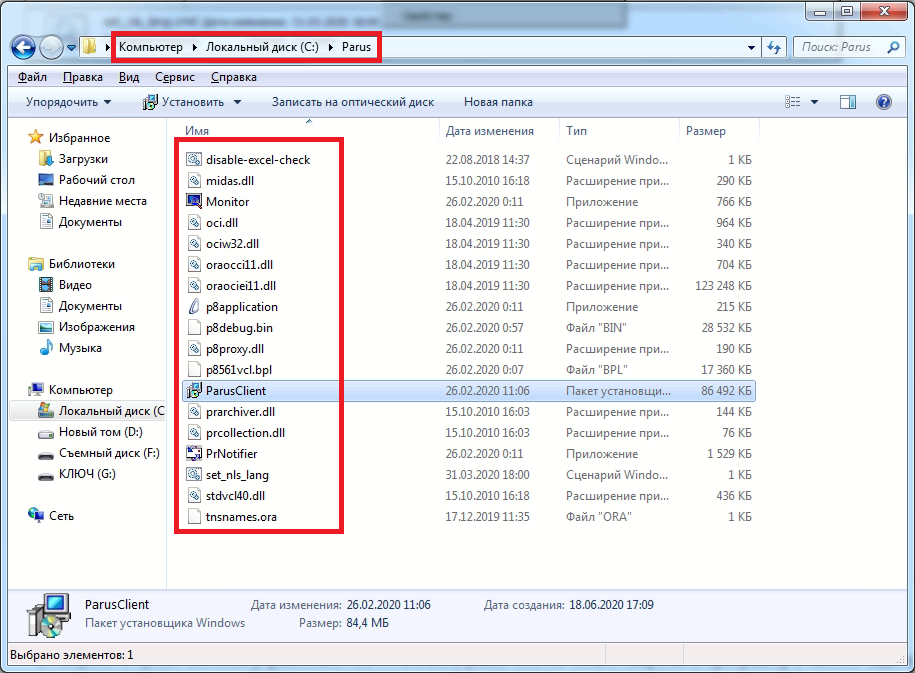
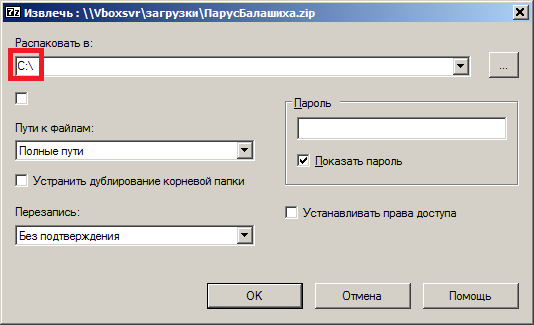
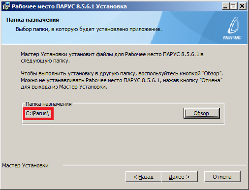
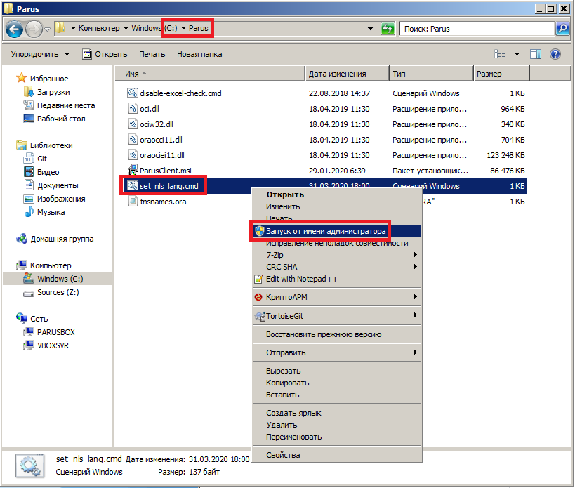

# Установка рабочего места Парус

## Важное предисловие

Цель установки Паруса — скопировать 1) файлы из архива и 2) файлы из дистрибутива при установке в каталог `C:\Parus`. Нужно сделать так, чтобы файлы `oci.dll` из архива и `p8application.exe` из дистрибутива оказалисть в одном каталоге, иначе при запуске Паруса он скажет, что отсутствует `oci.dll`. Должно получиться как на картинке:

> _Внимательность — залог успеха!_

## Установка
1. Скачайте дистрибутив, нажав на ссылку [ПарусБалашиха.zip](https://yadi.sk/d/R9dFKBj0JBJvEA) либо [ПарусКоролёв.zip](https://yadi.sk/d/fg2NYknKkZAikA). Если ссылка на эту инструкцию пришла к вам на телефон, откройте её на компьютере в браузере через [web.whatsapp.com](https://web.whatsapp.com/). Либо перешлите ссылку из WhatsApp себе на почту и откройте эту инструкцию из почты в браузере. Либо наберите в адресной строке браузера ссылку на Яндекс.Диск с архивом: для **Балашихи** наберите https://yadi.sk/d/R9dFKBj0JBJvEA, для **Королёва** https://yadi.sk/d/fg2NYknKkZAikA

2. Архив `ПарусБалашиха.zip` (либо `ПарусКоролёв.zip`) содержит каталог `Parus` с файлами. Разархивируйте этот каталог `Parus` из архива в корень диска `C:\`. Должно получиться **`C:\Parus`** (а не `C:\Parus\Parus`!)

> _Если возникает ошибка при разархивировании, скачайте и установите архиватор [7-zip](https://www.7-zip.org/)._

3. Запустите `C:\Parus\ParusClient.msi`. _**На этом моменте состедоточтесь и не пропустите важную деталь!**_ Когда появится диалоговое окно **Папка назначения** (Выбор папки, в которую будет установлено приложение) нажмите на кнопку **Обзор** и укажите папку назначения `C:\Parus`. Должно получиться как на картинке ниже. Только после этого нажмите на кнопку **Далее**. Если вы на автомате пропустили выбор папки назначения, удалите Парус: снова запустите `C:\Parus\ParusClient.msi` и выберите **Удалить**, затем сосредоточтесь и повторите действия этого пункта ещё раз.

4. Запустите `C:\Parus\set_nls_lang.cmd` от имени локального администратора (правая кнопка мыши, **Запуск от имени администратора**) для установки кодировки языка. Подтвердите выполнение. **На мгновение откроется и закроется консоль** с командами регистрации переменных окружения. Это установит русский язык в приложении.

> _В Windows XP просто запустите этот файл._

5. Запустите Парус, введите имя пользователя и пароль. Для заполнения пустых полей нажимайте кнопку **ОК**.

## Настройка
1. Закрепите ярлык **Система управления ПАРУС 8.5.6.1** (правая кнопка мыши, **Закрепить программу в панели задач**).
2. Удалите иностранные антивирусы.
3. Устанавите безплатный антивирус [Kaspersky Free](https://www.kaspersky.ru/free-antivirus) из Единого реестра российских программ. Это необязательное действие.
4. Установите безплатный офисный пакет LibreOffice вместо Excel по [инструкции по установке LibreOffice](libreoffice.md). Это необязательное действие.

## Решение проблем

1. Если при запуске Паруса возникает сообщение о библиотеке `oci.dll`, проверьте наличие файла `C:\Parus\p8application.exe`. Если файла по этому пути нет, удалите Парус через **Пуск, Панель управления, Удаление программ** (либо **Программы и компоненты** в Windows 10), затем установите в `C:\Parus` (см. раздел [Установка](#установка), п.3).
2. Если при формировании отчётов возникает ошибка:
* Запустите `C:\Parus\disable-excel-check.cmd` от имени локального администратора (правая кнопка мыши, **Запуск от имени администратора**).
* Откройте Excel, нажмите нопку `Office` (слева вверху), Параметры Excel, Центр управления безопасностью, Параметры центра управления безопасностью, Параметры макросов. Выберите `Включить все макросы` и поставьте флаг `Доверять доступ к объектной модели проектов VBA`, OK, OK.